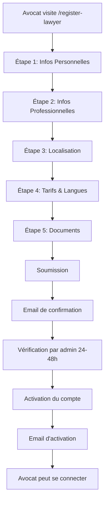

# 📋 Inscription Avocat - Guide Complet

## 🎯 Vue d'ensemble

La page d'inscription avocat est un formulaire multi-étapes professionnel conçu pour collecter toutes les informations nécessaires à l'enregistrement d'un avocat sur la plateforme Jurilab.

## 📍 Accès

- **URL**: `/register-lawyer` ou `/#/register-lawyer`
- **Lien depuis**: 
  - Page de connexion (en bas)
  - Footer (section "Pour les Avocats")
  - Menu mobile (quand non connecté)

## 🎨 Caractéristiques

### ✨ Interface Utilisateur
- **Design moderne** avec progression visuelle
- **5 étapes** clairement définies avec indicateurs
- **Validation en temps réel** des champs
- **Messages d'erreur** contextuels
- **Support du mode sombre**
- **Responsive** (mobile, tablette, desktop)

### 📊 Étapes du Formulaire

#### **Étape 1: Informations Personnelles** 👤
- Prénom
- Nom
- Email professionnel
- Téléphone
- Mot de passe (min. 8 caractères)
- Confirmation du mot de passe

**Validations:**
- Email valide requis
- Téléphone requis
- Mots de passe correspondants

---

#### **Étape 2: Informations Professionnelles** 💼
- Numéro d'inscription au Barreau
- Spécialité juridique (dropdown avec toutes les spécialités)
- Nom du cabinet
- Années d'expérience

**Validations:**
- Numéro au barreau requis (sera vérifié)
- Cabinet requis
- Expérience >= 0 ans

---

#### **Étape 3: Pratique & Localisation** 📍
- Biographie professionnelle (min. 50 caractères, max. 500)
- Ville
- Adresse du cabinet
- Code postal

**Validations:**
- Bio min. 50 caractères
- Tous les champs d'adresse requis

---

#### **Étape 4: Tarifs & Langues** 💶
- Tarif horaire (€/heure, minimum 50€)
- Langues parlées (sélection multiple)
  - Français, Anglais, Espagnol, Allemand, Italien
  - Arabe, Chinois, Portugais, Russe

**Validations:**
- Tarif >= 50€
- Au moins une langue requise

---

#### **Étape 5: Documents** 📄
- Photo de profil (optionnel, JPG/PNG, max 5MB)
- Certificat d'inscription au Barreau **obligatoire** (PDF, max 10MB)
- Diplôme de droit (optionnel, PDF, max 10MB)
- Récapitulatif des informations saisies
- Acceptation des conditions d'utilisation

**Important:** 
- Les documents seront vérifiés par l'équipe Jurilab
- Activation du compte sous 24-48h après vérification

---

## 🔧 Fonctionnalités Techniques

### Navigation
- **Bouton "Suivant"**: Valide l'étape actuelle avant de passer à la suivante
- **Bouton "Précédent"**: Retourne à l'étape précédente sans perdre les données
- **Bouton "Finaliser"**: Soumission finale à l'étape 5

### Gestion d'État
```typescript
interface LawyerFormData {
  // Toutes les données sont stockées localement
  firstName: string;
  lastName: string;
  // ... autres champs
}
```

### Validation
- Validation par étape
- Messages d'erreur contextuels
- Surlignage en rouge des champs invalides

### Upload de Fichiers
- Zones de drag & drop
- Aperçu des fichiers sélectionnés
- Validation du format et de la taille

---

## 🚀 Prochaines Améliorations Suggérées

### Backend Integration
```typescript
// TODO: Implémenter l'envoi au backend
const handleSubmit = async (formData: LawyerFormData) => {
  const response = await fetch('/api/lawyers/register', {
    method: 'POST',
    body: createFormData(formData),
  });
  // Gérer la réponse
};
```

### Fonctionnalités Supplémentaires
1. **Email de confirmation** après soumission
2. **Dashboard de suivi** pour voir le statut de la vérification
3. **Upload multiple** de diplômes/certifications
4. **Géolocalisation automatique** à partir de l'adresse
5. **Prévisualisation du profil** avant soumission
6. **Sauvegarde automatique** (localStorage) pour ne pas perdre les données
7. **Intégration avec l'Ordre des Avocats** pour vérification automatique du numéro

### Sécurité
- Validation côté serveur
- Vérification email (lien de confirmation)
- Vérification téléphone (SMS OTP)
- Vérification documents par un administrateur
- Conformité RGPD

---

## 📱 Screenshots

### Desktop
- Barre de progression en haut
- Formulaire centré avec largeur max 3xl
- Design épuré et professionnel

### Mobile
- Formulaire responsive
- Boutons empilés verticalement
- Zones d'upload tactiles

---

## 🎯 Workflow Complet



---

## 💡 Utilisation

### Pour les Développeurs

1. **Ajouter un nouveau champ:**
```typescript
// Dans LawyerFormData
interface LawyerFormData {
  // ... champs existants
  newField: string;
}

// Initialiser dans INITIAL_FORM_DATA
const INITIAL_FORM_DATA = {
  // ...
  newField: '',
};

// Ajouter dans le render de l'étape appropriée
<input 
  value={formData.newField}
  onChange={(e) => updateField('newField', e.target.value)}
/>
```

2. **Modifier la validation:**
```typescript
const validateStep = (step: number): boolean => {
  // Ajouter vos règles de validation
  if (step === 1) {
    if (!formData.newField) {
      newErrors.newField = 'Champ requis';
    }
  }
};
```

3. **Personnaliser le style:**
- Toutes les classes Tailwind sont modifiables
- Support du mode sombre avec `dark:` prefix
- Couleurs primaires configurables

### Pour les Admins

**Processus de vérification:**
1. Recevoir une notification de nouvelle inscription
2. Vérifier le numéro au barreau auprès de l'ordre
3. Examiner les documents uploadés
4. Approuver ou rejeter l'inscription
5. Envoyer l'email de confirmation/rejet

---

## 🐛 Debugging

```typescript
// Les logs sont activés dans le code
console.log('Form submitted:', formData);

// Pour voir les erreurs de validation
console.log('Validation errors:', errors);
```

---

## 📞 Support

Pour toute question technique:
- Email: dev@jurilab.fr
- Slack: #dev-inscription
- Documentation: https://docs.jurilab.fr

---

## ✅ Checklist de Déploiement

- [ ] Tests unitaires des validations
- [ ] Tests d'intégration du formulaire complet
- [ ] Test de l'upload de fichiers
- [ ] Vérification responsive (mobile, tablette, desktop)
- [ ] Test mode sombre
- [ ] Configuration des endpoints API
- [ ] Configuration S3/Storage pour les fichiers
- [ ] Email templates configurés
- [ ] Processus admin de vérification en place
- [ ] Monitoring et logs configurés
- [ ] Documentation utilisateur finalisée

---

**Version:** 1.0.0  
**Dernière mise à jour:** Novembre 2024  
**Auteur:** Équipe Jurilab Dev

